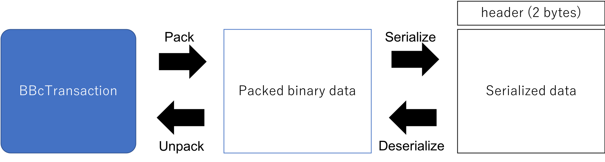

Data format of serialized BBc-1 transaction
========

BBc-1のトランザクションは、DBに保存したり、他者に送付したりするために、トランザクションデータをシリアライズする必要があります。
シリアライズされた情報はさらに圧縮等の変換を施してデータ化できる。データの関係性を下図に示す。



BBcTransactionオブジェクトをpackすると、バイナリフォーマットのデータに変換される（図の真ん中）。バイナリフォーマットのデータをさらに圧縮するなどの変換を施し、ヘッダを付加して、最終的なデータフォーマット (wire-format)とする。

なお、header部は2バイトの数値で、BBcFormatとして定義されており、serialize/deserializeのデータ変換方法を示す。

|数値|内容|
|----------|-------------|
|0x0000|無変換(packされたデータそのまま)|
|0x0010|packされたデータをzlibで圧縮|

### 非推奨のヘッダ値
version 1.1.1以前は、ヘッダの値（すなわちBBcFormatの値）として0x0001〜0x0006が定義されており、bson (binary Json)やmsgpackなどの形式を利用できるようになっていた。
しかし、署名範囲の計算方法がヘッダの値（packed binary dataの形式）に左右されてしまい、混乱をきたす可能性があるため、これらを非推奨としバイナリ形式を一本化することとした。

format\_type=BBcFormat.FORMAT\_BINARY(0x0000)を利用していた場合（デフォルト値なので意識していなければこれになっている）、この問題は特に発生しない。
それ以外を利用していた場合、v1.2のbbclib.pyはこれまでに作成されたトランザクションデータを読み込むことは可能であるが、
新しく作成するトランザクションはヘッダ値0x0000または0x0010のみに対応する。

## Programming
中間のpacked binary dataはbbclib.pyの中で隠蔽される。シリアライズデータ(txdata)を取得するには、下記のようにすれば良い。なお、txobjはBBcTransactionオブジェクトとする。
```python
from bbc1.core import bbclib

txdata = bbclib.serialize(txobj)
```

シリアライズデータをBBcTransactionオブジェクトに戻すには、下記のようにすれば良い。
```python
from bbc1.core import bbclib

txobj, fmt_type = bbclib.deserialize(txdata)
```

fmt_typeにはヘッダ値がセットされる。

## Backward comptibility
v1.2以前は、pack/unpackおよびserialize/deserializeが明確に分離されておらず、bbclib.pyですべての処理を行っていた。v1.2ではこれらを機能として明確に分離したため、上述のようにserializeとdeserializeの実施方法が変更になった。

v1.2以前のbbclib.pyを組み込んだアプリケーションコードを、そのままv1.2で利用できるようにするために、暫定的にcompatというモジュールを用意している。
v1.2以前のアプリケーションコードの冒頭で、
```python
from bbc1.core import bbclib
```
となっている部分を、
```python
from bbc1.core.compat import bbclib
```
に置き換えればよい。

なお、format\_type=BBcFormat.FORMAT\_BINARY(0x0000)以外を用いている場合は、bbc1.core.compat.bbclibを利用しなければ同じフォーマットでのトランザクションのシリアライズができない。
